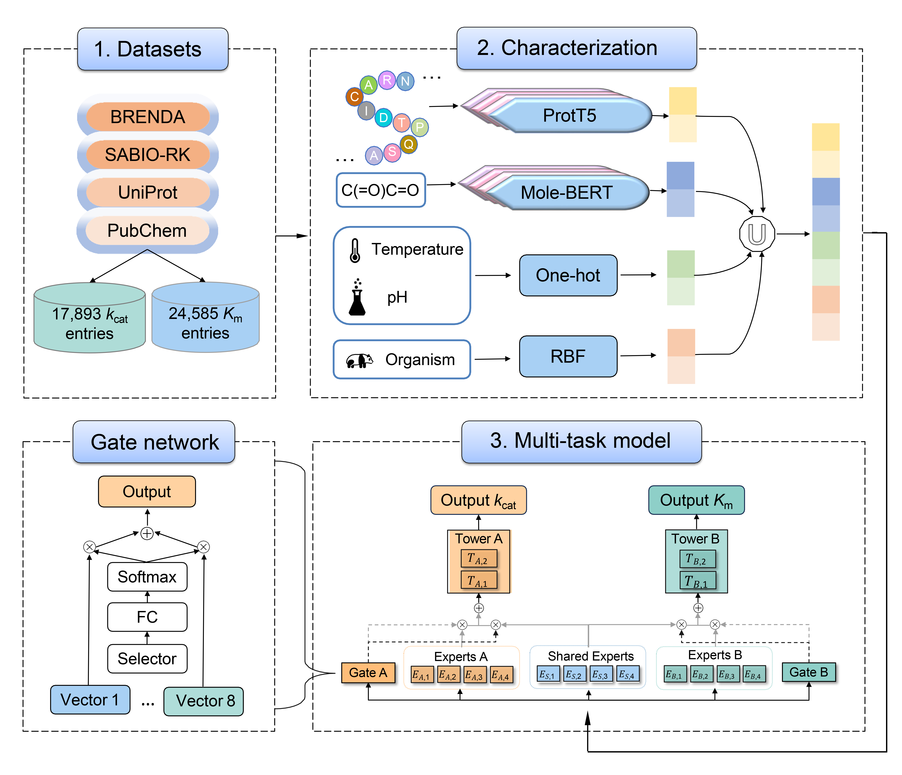

# MPEK: a multi-task learning based on pretrained language model for predicting enzymatic reaction kinetic parameters



## Background

MPEK is a universal tool for predicting enzyme turnover number (*k*<sub>cat</sub>) and Michaelis-Menten constant (*K*<sub>m</sub>) for all types of enzymes. It uses amino acid sequence of enzyme and SMILES of substrate as inputs, with pH, temperature and species information as optional inputs, and predicts *k*<sub>cat</sub> and *K*<sub>m</sub> based on the CGC multi-task learning framework at the same time. MPEK can comprehensively assess the catalytic efficiency of enzymes based on *k*<sub>cat</sub> and *K*<sub>m</sub>, which will enable rapid screening of efficient target enzymes and their mutants, and accelerate the process of enzyme directed evolution. Therefore, MPEK is expected to be a powerful tool for advancing biocatalysis, drug discovery, metabolic engineering, and other fields that rely on enzyme-catalyzed processes.

## Installation guide

### Prerequisites

- OS support: Linux
- Python version: >=3.8

### Dependencies

We used the following Python packages for core development. We tested on `Python 3.8`.

| name              | version  |
| ----------------- | -------- |
| numpy             | 1.24.3   |
| pandas            | 1.4.3    |
| networkx          | 3.1      |
| tqdm              | 4.65.0   |
| torch             | 1.12.0   |
| torch-cluster     | 1.6.0    |
| torch-scatter     | 2.1.0    |
| torch-geometric   | 2.2.0    |
| torch-sparse      | 0.6.14   |
| torch-spline-conv | 1.2.1    |
| transformers      | 4.32.1   |
| sentencepiece     | 0.1.97   |
| rdkit             | 2023.9.2 |
| tensorboard       | 2.15.1   |
| scikit-learn      | 1.2.2    |

### Installation

Clone codes and download necessary data files

```shell
git clone https://github.com/kotori-y/mpek.git
cd mpek/MTLKcatKM
wget https://drive.google.com/file/d/1e7IOSnQfHxII4KpOUitxlyrbBy-09DPm/view?usp=sharing # or other method
tar -zxvf checkpoints.tar.gz
```

## Pre-training and evaluating

### Pre-training

```shell
#device
DEVICE='cuda' # or cpu

# datasets
TRAIN_PATH='path/to/your/train/data'
TEST_PATH='path/to/your/test/data'
VALID_PATH='path/to/your/valid/data'

# required columns name
SEQUENCE_COLUMN='Sequence' # your column name of sequence filed in table
SMILES_COLUMN='SMILES' # your column name of smiles filed in table

# auxliary columns
ORGANISM_FLAG=1 # 1 for use organsim encoing, 0 for not
ORGANISM_COLUMN='Organism' # your column name of organism filed in table

PH_FLAG=1
PH_COLUMN='pH' # your column name of pH filed in table

TEMPERATURE_FLAG=1
TEMPERATURE_COLUMN='Temperature' # your column name of temperature filed in table

# out
CHECKPOINT_DIR='path/to/save/pretrained/model'
OUT_DIR='path/to/save/your/data/of/pretraining/progress'
```

```shell
sh pretrain.sh $DEVICE $TRAIN_PATH $TEST_PATH $VALID_PATH $SEQUENCE_COLUMN $SMILES_COLUMN $ORGANISM_FLAG $ORGANISM_COLUMN $PH_FLAG $PH_COLUMN $TEMPERATURE_FLAG $TEMPERATURE_COLUMN $CHECKPOINT_DIR $OUT_DIR
```

### Evaluating

```shell
#device
DEVICE='cuda' # or cpu

# data
TEAT_PATH='path/to/your/test/data'

# required columns name
SEQUENCE_COLUMN='Sequence' # your column name of sequence filed in table
SMILES_COLUMN='SMILES' # your column name of smiles filed in table

# auxliary columns
ORGANISM_COLUMN='Organism' # your column name of organism filed in table

PH_COLUMN='pH' # your column name of pH filed in table

TEMPERATURE_COLUMN='Temperature' # your column name of temperature filed in table
```

```shell
sh evaluate.sh $DEVICE $TEST_PATH $SEQUENCE_COLUMN $SMILES_COLUMN $ORGANISM_COLUMN $PH_COLUMN $TEMPERATURE_COLUMN
```

## Web Server

We also provide an easy-to-use web server: http://mpek.cmdrg.com.

## Contact

If you have questions or suggestions, please contact: yzjkid9@gmail.com.<br>Please see the file LICENSE for details about the "MIT" license which covers this software and its associated data and documents.